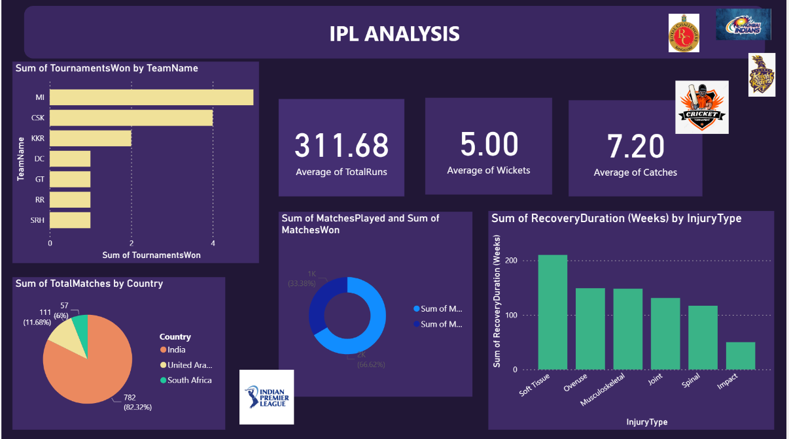

# Sports Analytics Database System

## Introduction
This project implements a comprehensive sports analytics database system focusing on cricket statistics, particularly for the Indian Premier League (IPL). The system is designed to track and analyze player performance, team statistics, tournament details, and various other cricket-related metrics.

## Database Features

### Core Components

1. **Table Structure**
   - 15+ interconnected tables including Player, Team, Coach, Tournament, Match, and more
   - Comprehensive tracking of player statistics (batting, bowling, fielding)
   - Team performance metrics and tournament details
   - Venue and franchise management

2. **Security Features**
   - Encrypted injury details using symmetric key encryption (AES_256)
   - Master key and certificate implementation
   - Secure handling of sensitive player medical information

3. **Stored Procedures**
   - `GetPlayerInfo`: Retrieves detailed player information
   - `TeamInfo`: Provides comprehensive team statistics
   - `MatchInfo`: Fetches match-specific details
   - `GetTeamWinningRate`: Calculates team performance metrics
   - `GetMatchesCountAtVenue`: Analyzes venue statistics
   - Multiple other procedures for specific analytics

4. **Triggers**
   - Audit tracking for major tables (Coach, Franchise, Team, Player, Company)
   - Automated logging of all INSERT and UPDATE operations
   - Detailed tracking of data changes with old and new values

5. **Views**
   - `TeamSummary`: High-level team performance overview
   - `PlayerSummary`: Comprehensive player statistics
   - `SeasonAnalysis`: Detailed season-wise analytics
   - `TeamAnalysis`: Team performance metrics
   - `MatchVenueDistribution`: Venue-based statistics

6. **Performance Optimization**
   - Non-clustered indexes on frequently queried columns
   - Composite indexes for complex queries
   - Optimized query performance for large datasets

7. **User-Defined Functions**
   - `CalculateTenure`: Computes coach tenure
   - `CalculateBattingAverage`: Determines player batting averages

## Interactive Dashboard
The database system supports an interactive dashboard (implemented separately) that provides:
- Real-time player performance tracking
- Team comparison tools
- Tournament statistics visualization
- Trend analysis features
- Injury tracking and management

## Conclusion
This sports analytics system provides a robust foundation for cricket data management and analysis. It combines secure data handling, efficient querying, and comprehensive tracking capabilities, making it suitable for professional sports management and analysis.

## Future Enhancements
- Integration with real-time scoring systems
- Advanced predictive analytics
- Mobile application support
- Enhanced security features
- Extended performance metrics